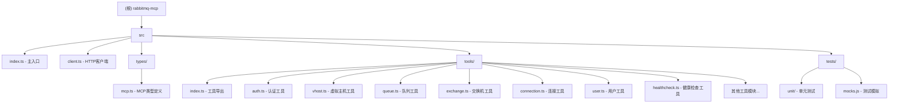

# RabbitMQ MCP - 项目架构文档

## 项目愿景

RabbitMQ MCP 是一个 Model Context Protocol (MCP) 服务器，为 RabbitMQ 提供完整的 HTTP API 功能接口。该项目旨在让 AI 助手（如 Claude Desktop、Cursor）能够通过自然语言与 RabbitMQ 进行交互，实现消息队列管理的自动化。

## 架构总览



### 核心架构特点

- **MCP 服务器模式**: 基于 `@modelcontextprotocol/sdk` 构建的标准 MCP 服务器
- **工具化设计**: 将 RabbitMQ HTTP API 封装为独立的 MCP 工具，每个工具对应特定的 RabbitMQ 功能
- **类型安全**: 使用 TypeScript 和 Zod 进行强类型定义和参数验证
- **模块化结构**: 按功能领域划分工具模块（认证、虚拟主机、队列、交换机等）

## 模块索引

| 模块路径 | 职责描述 | 主要功能 |
|---------|---------|---------|
| `src/` | 核心源码目录 | MCP服务器入口和核心组件 |
| `src/tools/` | 工具模块集合 | RabbitMQ各功能领域的MCP工具封装 |
| `src/tools/auth.ts` | 认证工具 | 联邦链接、认证尝试、密码哈希等 |
| `src/tools/vhost.ts` | 虚拟主机管理 | VHost CRUD、权限管理、限制设置 |
| `src/tools/queue.ts` | 队列管理 | 队列创建、查询、清空、删除等操作 |
| `src/tools/exchange.ts` | 交换机管理 | 交换机 CRUD 和绑定管理 |
| `src/tools/connection.ts` | 连接管理 | 连接查询和强制关闭 |
| `src/tools/user.ts` | 用户管理 | 用户 CRUD 和标签管理 |
| `src/tools/healthcheck.ts` | 健康检查 | 集群健康状态和告警监控 |
| `src/tests/` | 测试目录 | 单元测试和模拟对象 |

## 运行与开发

### 环境变量配置

项目需要以下必需的环境变量：
- `RABBITMQ_HOST` - RabbitMQ 主机地址
- `RABBITMQ_USERNAME` - 用户名
- `RABBITMQ_PASSWORD` - 密码
- `RABBITMQ_MANAGEMENT_PORT` - 管理端口

可选配置：
- `RABBITMQ_PROTOCOL` - 协议（默认 https）
- `RABBITMQ_BASE_PATH` - API 基础路径（默认 /api）
- TLS/HTTPS 相关证书配置

### 构建与运行

```bash
# 构建
npm run build

# 启动服务器
npm start

# 运行测试
npm test
```

## 测试策略

- **单元测试覆盖**: 每个工具模块都有对应的单元测试文件
- **Mock 策略**: 使用 Jest 模拟 HTTP 请求，避免依赖真实 RabbitMQ 实例
- **测试环境配置**: 通过 `jest.setup.mjs` 配置测试环境变量

## 编码规范

- **TypeScript 严格模式**: 启用所有严格类型检查
- **ESM 模块**: 使用 ES 模块系统
- **Zod 验证**: 所有工具参数使用 Zod 进行类型定义和验证
- **统一错误处理**: 通过 `rabbitHttpRequest` 统一处理 HTTP 错误

## AI 使用指引

### 工具分类

该 MCP 服务器提供以下类别的工具：

1. **认证与安全**: 用户认证、权限管理、联邦配置
2. **虚拟主机**: VHost 生命周期管理和配置
3. **消息组件**: 队列、交换机、绑定的管理
4. **连接与通道**: 连接监控和管理
5. **集群管理**: 节点状态、健康检查
6. **策略与参数**: 策略配置和运行时参数

### 使用示例

```
# 查看虚拟主机列表
list-vhosts

# 获取特定队列详情
get-queue with vhost="production" name="email-queue"

# 检查集群健康状态
get-health-alarms
```

## 变更记录 (Changelog)

**2025-10-20 14:52:21** - 初始化架构分析
- 完成项目结构和模块识别
- 生成根级架构文档和 Mermaid 结构图
- 识别 15 个工具模块和完整的测试覆盖

---

*此文档由架构师自动生成，包含项目初始化分析结果*